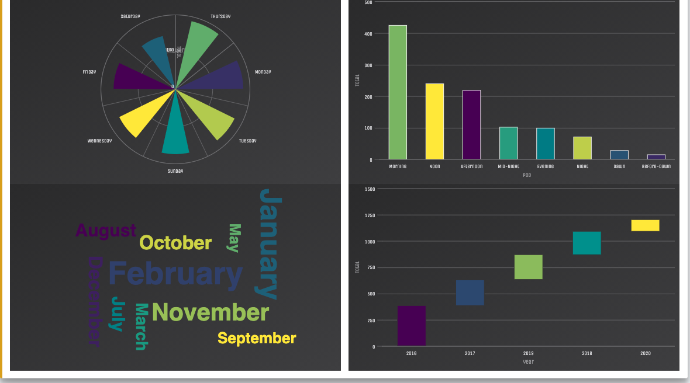

# digital_transport_GOVHACK2021
This is a repository with information of the tool developed for my govhack2021 entry.

This was developed using R and Shiny. All the scripts as well as the databased can be found in the final app folder.

This can be used if the app cannot be run from the server. If this is the case, the app can be run from locally installed files.

## The challenge

### Mental Health Aspect
Data from the mental health shows that Canberrans highly value the ACT is a good place to live (86%) and that local areas have a high level if liveability (88%). This shows that if there are more ways to make public spaces more accessible, this will help Canberrans to improve their chances of experiencing more the city and its surroundings.

On the other hand, the data shows that living in post pandemic world has affected our mental health. It shows that 21% are experiencing loneliness and 11% struggling with social connections. These statistics show that it is necessary to create more opportunities of connection and social interaction. For this reason, one efficient way is to make public spaces, especially in nature, like playgrounds, nature parks, lakes, etc, more accessible. In this way, it helps people connecting but also allows people be more scattered and not overcrowding smaller spaces.

### Vehicles and Zero Emissions
The data explored in the Transport across time shows that there is a small, yet relevant trend, of people slowly trying to go into more environmentally friendly options. Another assessment of the data, shows that people rely heavily on public transportation to go to places. This suggests that people can use more public transportation if this allows a more efficient way of taking care of pour environment.

## A solution
Since Public Transport plays such an important role in our community, we propose that bus stops do not function just as transitions points from places, but also places from where passengers can have more information accessible to open and public places nearby.

Public transport routes go across all the veins and arteries of our city. We can then maximize this by connecting people to places they might not even know exist. This requires, not a change in the physical infrastructure, but rather a digital infrastructure. For this, we can also maximise the fact that Canberrans have easy access to networks in which tools like the ones here presented can be made accessible.

This is why we have designed and put together this tool. This is a functional prototype of the power and reach that public transformation can have in a post-pandemic world, keeping up with the new technological advances available at our fingertips.

## Data sources
This tool drew data from different publically available sources. 

### Here are the main ones:

All Wellbeing Measures: https://www.data.act.gov.au/dataset/All-Wellbeing-Measures/b5kg-deh8

Canberra Metro Light Rail Transit Feed - Trip Updates (Historical Archive): https://www.data.act.gov.au/Transport/Canberra-Metro-Light-Rail-Transit-Feed-Trip-Update/jxpp-4iiz

Daily Public Transport Passenger Journeys by Service Type: https://www.data.act.gov.au/Transport/Daily-Public-Transport-Passenger-Journeys-by-Servi/nkxy-abdj

Vehicle registrations by motive power: https://www.data.act.gov.au/Transport/Vehicle-registrations-by-motive-power/x4hp-vihn

### Other datasets include:

ACT Playgrounds: https://actmapi-actgov.opendata.arcgis.com/datasets/ACTGOV::play-grounds/about

ACT Barbeques: https://actmapi-actgov.opendata.arcgis.com/datasets/ACTGOV::barbeques/about

ACT Dog Parks: https://actmapi-actgov.opendata.arcgis.com/datasets/ACTGOV::dog-parks/about

ACT Public Furniture: https://actmapi-actgov.opendata.arcgis.com/datasets/ACTGOV::public-furniture/about

ACT Public Toilets: https://actmapi-actgov.opendata.arcgis.com/datasets/ACTGOV::public-toilets/about

## The online tool

Link: https://phoneapps.shinyapps.io/digital_transport_govhack2021/

Video: https://www.youtube.com/watch?v=CfK6GcTBpBs&ab_channel=Sim%C3%B3nGonz%C3%A1lez

The online tol has been developed to be used by both people who are interested on ACT and open spaces, as well as personnel from institutions inetrested in having all this material in one place.

## As fast as a click
The aim was also to allow users navigate the tool with simple clicks on tabs and dropdown menues. I hope this facilitates the maximisation of the rich data.

## Sample Views

## Visualisations
This tool has been designed to be as user-friendly as possible. The apporach was to have simple yet highly easthetically data plots.

These are sample images of the different sections of the app:

### Transport Timeline

### Transport Journeys Timeline

### Motive Power Timeline

### WildLife Accidents Dashboard

### Wildlife Accidents Stats

### Playgrounds Dashboard

### Bus Stops and Close Places

